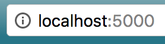
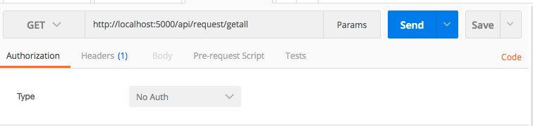

# TheSocialApp Backend Restful Api

This project was created to serve as a backend for my final project at Nashville Software School. This project combined my knowledge of C# ASP.Net Core and MongoDb to create a backend restful api for my other project [here](https://github.com/justinal64/thesocialappfinal). This project allows the user to Authenticate, store data, and retrieve data from a MongoDB.  


## Getting Started

To download the project open up a terminal and type
```
git clone git@github.com:justinal64/thesocialappv3.git
```
This will download the project to your local computer. 

Next cd into the project
```
cd thesocialappv3
```
Once you are in the proper directory type
```
npm install
```
to install all the project dependencies.
<br />
Next type 
```
code . 
```
in your terminal to open the project in VS Code.
<br />
I recommend using VS Code to run this project, but we can argue over the best IDE another time ;). 

### Prerequisites
#### MongoDB
Before you can run this project you need to have MongoDB install and running. To install and configure MongoDB please following [this](https://docs.mongodb.com/manual/installation/#tutorials) tutorial.

Once you have MongoDB up and running in a terminal cd into the project directory and run the following command
```
mongo demoDB ./requestdata.js
```
This will put some basic user data in your database, so you have something to query. 

### Not Required but Highly Recommended

#### Postman
Postman is a tool used to query data without a frontend application. To install Postman please following [this](https://www.getpostman.com/docs/postman/launching_postman/installation_and_updates) tutorial. I will be using Postman below to show you how to put/post/get/delete data from the application. 


#### MongoDB Compass
MongoDB Compass is a tool used to look at data that is being stored in a MongoDB. You don't need it for this project, but if you want to see the data in your MongoDb it is a great tool for data visualization. To install a free version please go [here](https://www.mongodb.com/products/compass). 

### Installing

Now that you have installed all the Prerequisites it's time to see if it all worked. Open your project in VS Code and either click Ctrl+ F5 or Debug->Start Debugging. This will start your server. After a few seconds a blank webpage should appear in your browser like this. 

If the port is different from 5000 please use the port listed on your screen. For my examples I will be using 5000. 

Open postman and setup postman like this screenshot. 



## Built With
* [Asp.Net Core](https://docs.microsoft.com/en-us/aspnet/core/) - The web framework used
* [MongoDB](https://www.mongodb.com/) - Database Used

## Author

https://github.com/justinal64
* [Justinal64](https://github.com/justinal64) - Justinal64

## License

This project is licensed under the MIT License - see the [LICENSE.md](LICENSE.md) file for details
